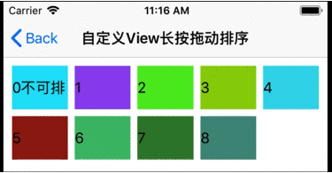
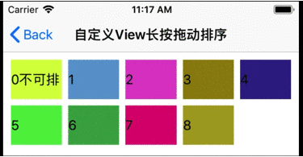
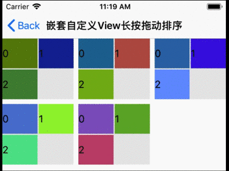

# YHLongPressDragSort

长按拖动排序封装，支持UICollectionViewCell、UITableViewCell、自定义View，以及嵌套使用。

[](https://travis-ci.org/ye_linux@126.com/YHLongPressDragSort)
[](https://cocoapods.org/pods/YHLongPressDragSort)
[](https://cocoapods.org/pods/YHLongPressDragSort)
[](https://cocoapods.org/pods/YHLongPressDragSort)

## Features






## Example

To run the example project, clone the repo, and run `pod install` from the Example directory first.

## Requirements

## Installation

YHLongPressDragSort is available through [CocoaPods](https://cocoapods.org). To install
it, simply add the following line to your Podfile:

```ruby
pod 'YHLongPressDragSort', :git => 'https://github.com/yelinux/YHLongPressDragSort.git'
```

Run `pod install` or `pod update`.

### Manually (old school way)
Drag the `YHLongPressDragSort/Classes` folder into your project.

## Usage
1. Enable long press drag sorting for UICollectionViewCell:
```objective-c
#import "YHLongPressDragSort.h"

    __weak typeof(self)weakSelf = self;
    // 启用长按拖动排序
    [self.collectionView yh_enableLongPressDrag:^BOOL(NSIndexPath * _Nonnull indexPath, CGPoint pressPoint) {
        // 哪些cell可以长按拖动排序
        return indexPath.row != 0;
    } isDragMoveItem:^BOOL(NSIndexPath * _Nonnull from, NSIndexPath * _Nonnull to) {
        // 拖动到某位置是否确定插入排序
        if (to.row != 0) {
            //更新数据源
            id obj = [weakSelf.models objectAtIndex:from.row];
            [weakSelf.models removeObject:obj];
            [weakSelf.models insertObject:obj atIndex:to.row];
            return YES;//允许插入排序
        }
        return NO;//不允许插入排序
    }];
```

2. Enable long press drag sorting for UITableViewCell:
```objective-c
#import "YHLongPressDragSort.h"

    __weak typeof(self)weakSelf = self;
    // 启用长按拖动排序
    [self.tableView yh_enableLongPressDrag:^BOOL(NSIndexPath * _Nonnull indexPath, CGPoint pressPoint) {
        // 哪些cell可以长按拖动排序
        return indexPath.row != 0;
    } isDragMoveItem:^BOOL(NSIndexPath * _Nonnull from, NSIndexPath * _Nonnull to) {
        // 拖动到某位置是否确定插入排序
        if (to.row != 0) {
            //更新数据源
            id obj = [weakSelf.models objectAtIndex:from.row];
            [weakSelf.models removeObject:obj];
            [weakSelf.models insertObject:obj atIndex:to.row];
            return YES;//允许插入排序
        }
        return NO;//不允许插入排序
    }];
```

3. Enable long press drag sorting for your custom view（建议参考Example/YHLongPressDragSort/Classes/YHDragSortGridView.h.m）:
```objective-c
#import "YHLongPressDragSort.h"

//继承YHDragSortBaseView基类
@interface XXXView : YHDragSortBaseView

@end

@implementation XXXView

-(void)setXXXSubViews: (NSArray<UIView*>*)views{
    self.subItemViews = views;
    [self.subItemViews enumerateObjectsUsingBlock:^(UIView *view, NSUInteger idx, BOOL * _Nonnull stop) {
        [self addSubview:view];
    }];
    // 布局
    [self refreshSubItemPosition];
}

// 重写基类布局方法
-(void)refreshSubItemPosition{
    [self.subItemViews mas_remakeConstraints:^(MASConstraintMaker *make) {
    }];
    // 按照subItemViews顺序布局
}

@end

```

## Author

WeChat:chenyehong666888, E-mail:ye_linux@126.com

## License

YHLongPressDragSort is available under the MIT license. See the LICENSE file for more info.
